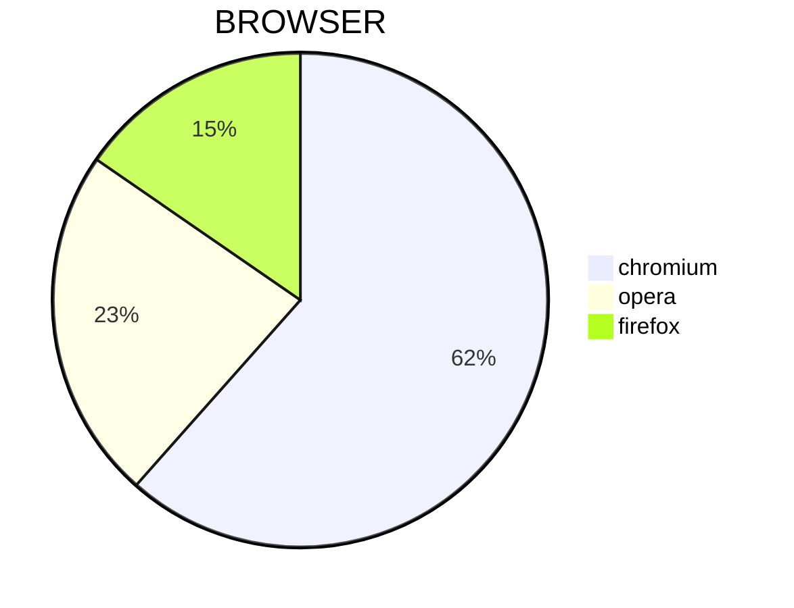

# Markdown

**Markdown** - простое форматирование документа, пригодное для Git-репозиториев, докуминтации и заметок.


### Курор

Клавиши


- `Home`    - курсор в начало сторки
- `END`     - крусор в конец строки
- `pgUP`    - курсор вверх видимой части документа

### выделение текста

 - `Ctrl+A` - выделить весь текст
 - `Ctrl+>` - выделить смвол справа от курсора
 - `Ctrl+<` - выделить символ слева от курсора
 - `Ctrl+S` - сохранить документ
 - `Сtrl+C` - копировать выделенное
 - `Ctrl+V` - вставить выделенное
 - `Shift+>`- посимвольное выделение вправо
 - `Shift+<`- посимвольное выделение влево
 - `Ctrl+Shift+>` - пословное выделение текста вправо
 - `Ctrl+Shift+<` - пословное выделение текста влево

### Копирование/вставка

 - `Ctrl+Shift+C` - копировать выделенное в терминале
 - `Ctrl+Shift+V` - вставить выделенное в терминале

 ### Редактирование тескта
 - `Del` - удалить символ справа от курсора
 - `Backspace` - удалить символ слева от курсора
 - `Ins/Insert` - замещение старого тескта новым справа от курсора
 - `Ctrl+>` - перемещение по словам вправо
  - `Ctrl+<` - перемещение по словам влево


---

## Markdown

Заголовик

# - заголовок 1-го уровня
## - заголовок 2-го уровня
### - заголовок 3-го уровня
#### - заголовок 4-го уровня

Текст

 - **Жирный тескт**
 - *курсив*
 - 


  Ссылки

 Внутрениие ссылки
 [какая-то страница](/README.md)

Якоря по документу
- [Редактирование тескта](#редактирование-тескта)

Внешние ссылки
[ozon](https://www.ozon.ru/?__rr=1)

Изображения


Код

`Ctrl+R` - обновить страницу браузера
`F5` - обновить страницу браузера

```python
print("hello")
```
```cpp
int main(){
  pust("hello");
}
```

цитаты
> чем гуще лес скибиди ес ес

Таблицы
| headline1 | headline2 | healdine3|
|-----------|-----------|----------|
| textbox1  |textbox2   |textbox3  |
| textbox4  |textbox5   |textbox6  |
|           |           |          |
