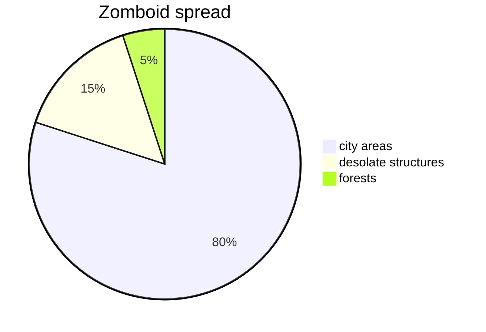

# Project zomboid
---

  

---

## Project zomboid
- `Project Zomboid is the ultimate in zombie survival. Alone or in MP: you loot, build, craft, fight, farm and fish in a struggle to survive. A hardcore RPG skillset, a vast map, massively customisable sandbox and a cute tutorial raccoon await the unwary. So how will you die? All it takes is a bite..`
---
- `НЕДАВНИЕ ОБЗОРЫ:
Очень положительные (7 635)`
- `ОБЗОРЫ (РУССКИЙ):
Очень положительные (48 968)`
- `ДАТА ВЫХОДА:
8 ноя. 2013 г.`
- `РАЗРАБОТЧИК:
The Indie Stone`
- `ИЗДАТЕЛЬ:
The Indie Stone`
---
### Project Zomboid — игра на выживание в открытом мире, охваченном зомби-апокалипсисом. Действие разворачивается в американском штате Кентукки, где вам предстоит искать припасы, обустраивать убежище и бороться за каждый новый день.
#### Геймплей
Здесь недостаточно просто избегать зомби. Персонаж испытывает голод, жажду, усталость, страх и боль. Даже небольшая ошибка — разбитое окно, забытая повязка или слишком шумная вылазка — может обернуться катастрофой.
Основной геймплей:
- Поиск ресурсов: добывайте еду, лекарства, инструменты и оружие.
- Обустройство базы: укрепляйте двери и окна, храните припасы и создавайте безопасное место для отдыха.
- Развитие навыков: осваивайте кулинарию, строительство, механику, сельское хозяйство и другие полезные навыки.
- Исследование мира: обыскивайте дома, магазины и склады, находите транспорт и планируйте маршруты.
- Борьба за жизнь: выбирайте между боем, скрытностью и отступлением.
Особенности
- Изометрическая графика и мрачная атмосфера.
- Подробная система состояния персонажа, травм и болезней.
- Постепенное разрушение привычного быта: отключение электричества и воды, порча продуктов.
- Гибкие настройки песочницы, позволяющие менять сложность выживания.
- Одиночная игра, многопользовательский режим и поддержка модификаций.
Атмосфера и цель
В Project Zomboid нет гарантированного спасения. Вы сами ставите цели: продержаться первую неделю, найти надёжный автомобиль или создать автономное убежище.
Это история не о том, как вы спасли мир, а о том, сколько вам удалось прожить.

Project Zomboid подойдёт тем, кто любит вдумчивое выживание, свободу действий и истории, возникающие из собственных решений.
---
## Распределение зомби в Project zomboid
На ванильных настройках в своем большиенстве зомби спавнятся в городских метсностях.

---
## Спавн лута 
спавн лута в зомбоиде зависит от того где он генерируется:
| клиники   | кухни | военные мет. шкафы|
|-----------|-----------|----------|
| медикаменты  |еда   |боеприпасы  |
| книги по первой помощи  |столовые приборы   |огнестрел  |
|           |           |          |
---
P.s
- `this page is an exercise to understand the use of markdown, do not take this page seriously`